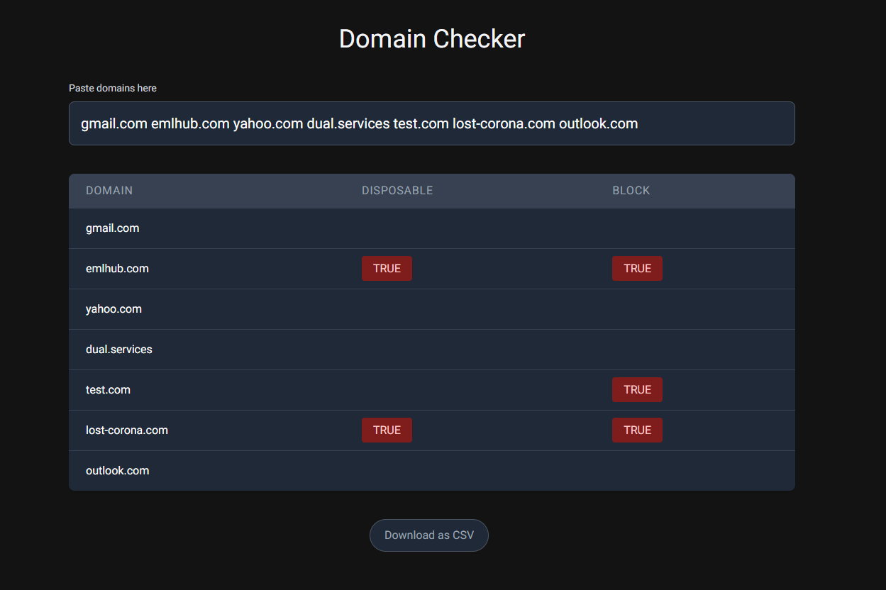

# Domain Checker

## Overview

A fraud investigation tool used to check for invalid and disposable email domains.

- [Live Demo](https://dc3.vercel.app/)

## Features

The app was built with Node and JavaScript in Next.js using the official API provided by check-mail.org. The user can paste in the domains that they want to check, and the App will render a results table with additional columns that contain data of interest.

- Type - If the domain is considered disposable or not.
- Block - The domain is not disposable, but is high risk and should be blocked anyway.

An export button was also included for larger queries. The user may want to download the entire results table as a CSV file for filtering and spreadsheet lookups.
Tech Specs

I am using Next API routes as a server-side solution for the API endpoints. This takes additional load off the client with the additional bonus of keeping our API secrets hidden from the browser client.

The API endpoint receives an array of email domains then does a web request for each of these items. We return a Promise.all() event once the individual requests have completed and merge the specific data fields into a new JSON object. This JSON object is sent back to the client as a HTTP "200" response.
On the client side, we are waiting for this HTTP "200" response before the table of results can be updated. The form data is managed via React Hooks which will be updated upon a successful API request.
